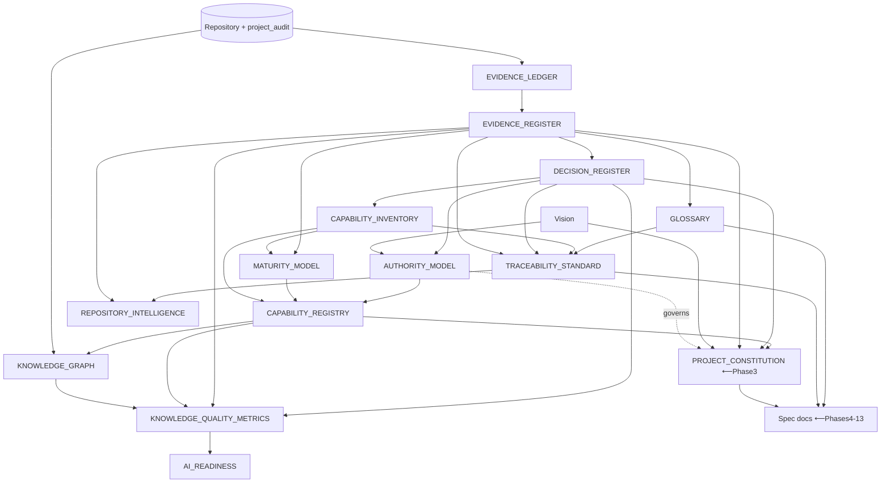

# Document Dependency Map

> **Status:** ACTIVE (Phase 2.8). Shows which document **depends on** (must be read /
> cited by) which. "A → B" means *A depends on B* (B must exist/be-true for A to be valid).
> Reading order for authoring is the reverse of the arrows (build foundations first).

---

## 1. Dependency table

| Document | Depends on | Why |
|---|---|---|
| Vision (`source/_Super Creator OS V.1.md`) | — | root strategic truth |
| `EVIDENCE_LEDGER.md` | repository, `project_audit/*` | atomizes evidence |
| `EVIDENCE_REGISTER.md` | `EVIDENCE_LEDGER.md`, repository | IDs over the ledger |
| `DECISION_REGISTER.md` | `EVIDENCE_REGISTER.md` | each DD cites EV |
| `CAPABILITY_INVENTORY.md` | `EVIDENCE_REGISTER.md`, `DECISION_REGISTER.md` | CAP cite EV/DD |
| `GLOSSARY.md` | `EVIDENCE_REGISTER.md` | terms cite EV |
| `AUTHORITY_MODEL.md` | Vision, `DECISION_REGISTER.md` | hierarchy from decisions |
| `MATURITY_MODEL.md` | `CAPABILITY_INVENTORY.md`, `EVIDENCE_REGISTER.md` | levels over capabilities |
| `TRACEABILITY_STANDARD.md` | all three registers, `GLOSSARY.md` | rules over the IDs |
| `CAPABILITY_REGISTRY.md` | `CAPABILITY_INVENTORY.md`, `MATURITY_MODEL.md`, `AUTHORITY_MODEL.md` | governance over the spine |
| `DOCUMENT_DEPENDENCY_MAP.md` (this) | all `_knowledge/*` | maps them |
| `KNOWLEDGE_GRAPH.md` | all registers + repository | nodes/edges over everything |
| `REPOSITORY_INTELLIGENCE.md` | `EVIDENCE_REGISTER.md`, `TRACEABILITY_STANDARD.md` | search/verify rules |
| `KNOWLEDGE_QUALITY_METRICS.md` | all `_knowledge/*` | measures them |
| `AI_READINESS.md` | all `_knowledge/*` | assesses the set |
| `PROJECT_CONSTITUTION.md` (Phase 3) | Vision, `AUTHORITY_MODEL.md`, all registers | governance over intent |
| Spec docs (Phases 4–13) | Constitution, `TRACEABILITY_STANDARD.md`, registers, `GLOSSARY.md` | intent citing evidence |
| `TERMINOLOGY.md` (Phase 8) | `GLOSSARY.md` | pointer-view only |

## 2. Graph

## 3. Authoring order (foundations first)

1. Repository/audits → 2. Evidence Ledger → 3. Evidence Register → 4. Decision Register →
5. Capability Inventory + Glossary → 6. Authority + Maturity + Traceability →
7. Capability Registry → 8. Graph + Repo-Intelligence → 9. Quality Metrics + AI Readiness →
**10. (Phase 3) Constitution** → 11. (Phases 4–13) Specs.

No cycles exist in this graph (it is a DAG); every document has a defined place. ✓
