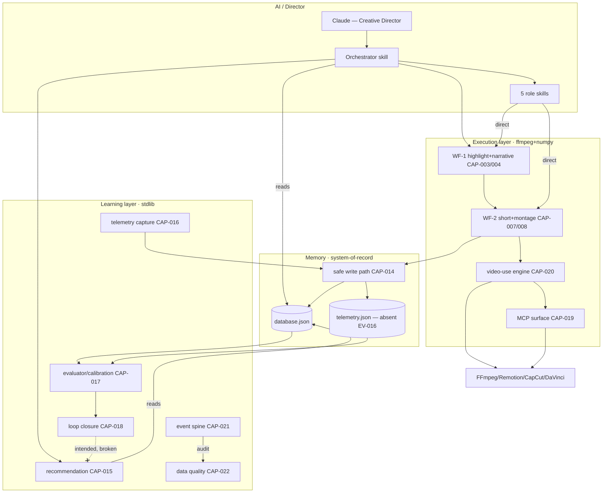
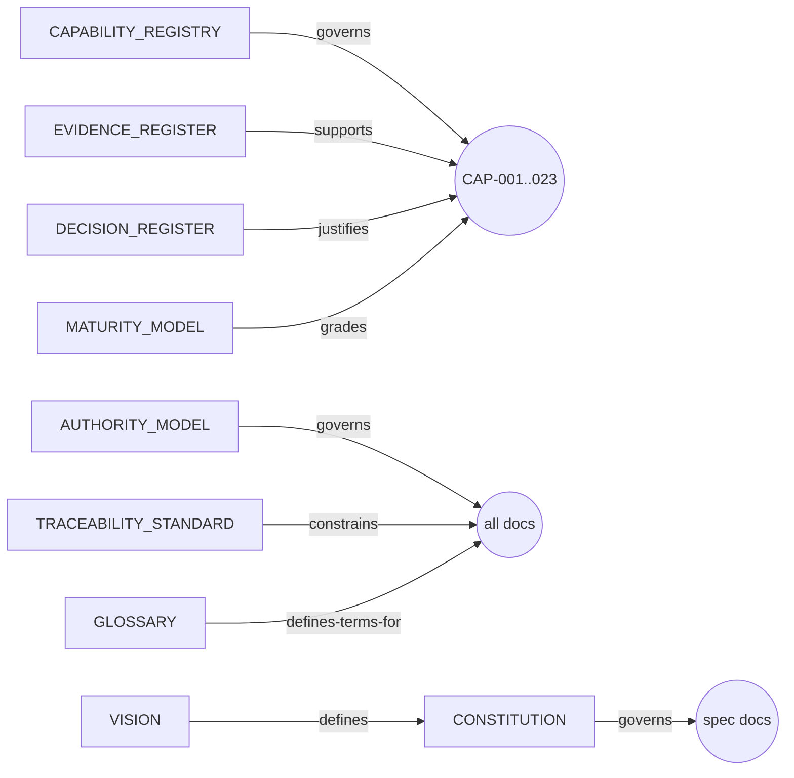
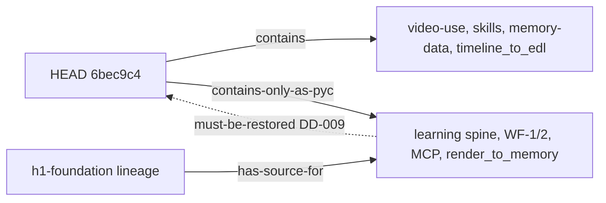

# Knowledge Graph

> **Status:** ACTIVE (Phase 2.8). The unified node/edge view of the system's knowledge.
> A machine-readable serialization (`knowledge.graph.json`) is deferred to Phase 2.9.
> Edges use a controlled vocabulary: **owns, defines, validates, depends-on, produces,
> consumes, reads, writes, governs, implements**.

---

## 1. Node types

| Type | Examples | Source |
|---|---|---|
| Document | Vision, Constitution, spec docs, EKB docs | `AUTHORITY_MODEL.md` |
| Capability | CAP-001…CAP-023 | `CAPABILITY_REGISTRY.md` |
| Agent/Skill | orchestrator, storytelling, video-editor, qa-reviewer, retention-expert, social-media-manager | EV-012 |
| Workflow | 15-step pipeline; WF-1; WF-2; WF-3 | EV-009, EV-011 |
| Memory | database.json, telemetry.json, schemas, backups | EV-013–EV-017 |
| Pipeline/Engine | video-use engine; ffmpeg render path | EV-018 |
| External system | FFmpeg, Remotion, CapCut, DaVinci, ElevenLabs Scribe | EV-002, EV-014 |
| MCP | scos_video_mcp (11 tools) | EV-019 |
| Database | memory store (system-of-record) | EV-013 |
| AI provider | Claude (director/creative reasoning) | EV-002 |
| Repository | HEAD lineage; h1-foundation lineage | EV-032 |

## 2. Core graph (subsystems & flow)

The dashed broken edge **LOOP ⇏ REC** is the open learning seam (EV-025, CAP-018).

## 3. Document ↔ capability ownership (selected edges)

## 4. Lineage edges (the central hazard)

## 5. Edge inventory (summary)

| Edge type | Count (approx) | Notes |
|---|---|---|
| reads/writes (memory) | 6 | only via CAP-014 (DD-002) |
| produces/consumes (pipeline) | 12 | WF-1→WF-2→engine→external |
| governs/defines (docs) | 15 | authority + traceability |
| supports/justifies (EV/DD→CAP) | 60+ | the traceability spine |
| broken/intended | 1 | LOOP⇏REC (EV-025) |

Nodes across all types are reachable; the only intentionally broken edge is the documented
open loop. A JSON serialization will make these edges queryable (Phase 2.9).
